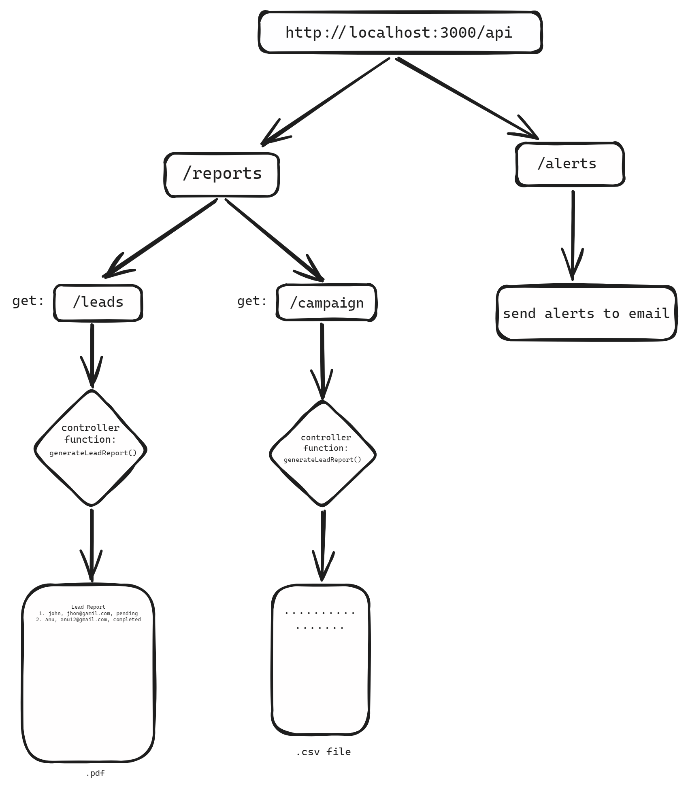
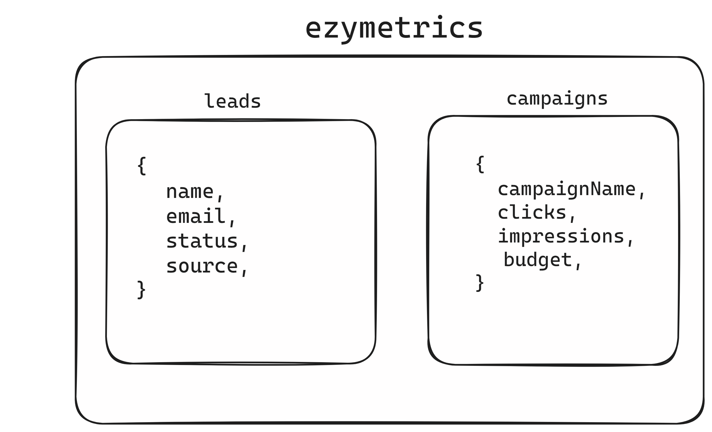

# EzyMetrics Backend

This project implements the backend for EzyMetrics, focusing on data integrations with CRM and Marketing platforms, generating reports, and sending alerts via email. It uses Node.js, MongoDB, and Nodemailer for sending emails.

## Features

- **Data Integrations**: Fetch dummy data from CRM and marketing platforms for leads and campaigns.
- **Data Storage**: Store fetched data in MongoDB.
- **ETL Process**: Extract, Transform, and Load (ETL) processes to transform raw data into meaningful metrics.
- **Reporting**: Generate lead reports in PDF format and campaign reports in CSV format.
- **Alerts**: Send email notifications based on specific conditions.

## Tech Stack

- **Node.js**: Backend runtime environment.
- **Express**: Node.js web framework.
- **MongoDB**: NoSQL database for storing lead and campaign data.
- **Mongoose**: MongoDB object modeling for Node.js.
- **Nodemailer**: Module for sending email alerts.
- **PDFKit**: Generate PDFs for lead reports.
- **json2csv**: Convert JSON to CSV for campaign reports.

## Installation

1. **Clone the repository**:
   ```bash
   git clone https://github.com/yourusername/ezymetrics-backend.git
   cd ezymetrics-backend

2. **Install dependencies**:
   ```bash
   npm install

3. **Set up environment variables**
   ```bash
    EMAIL_USER=<your-gmail>
    EMAIL_APP_PASSWORD=<gmail-app-password>
    DATABASE_URL=<mongodb-url-string>
    PORT=<port>
    PROJECT_TOKEN=<your-mockapi-project-token>

4. **Start the server**
    ```bash
    npm start




